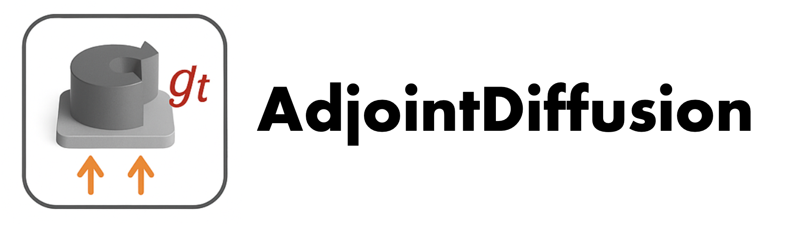
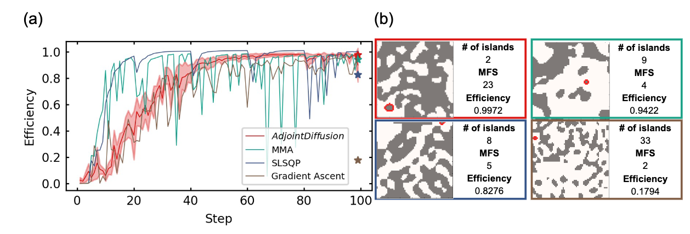
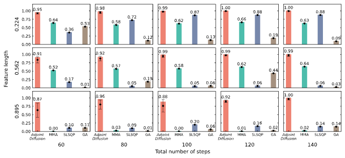
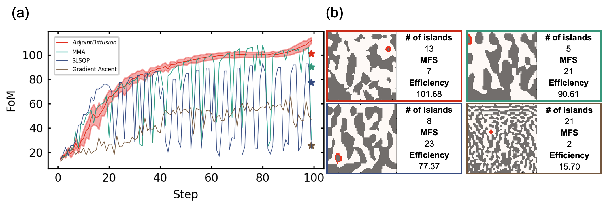
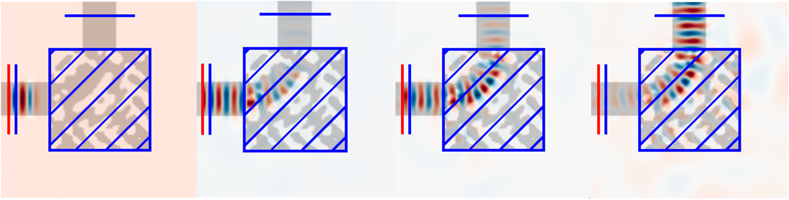
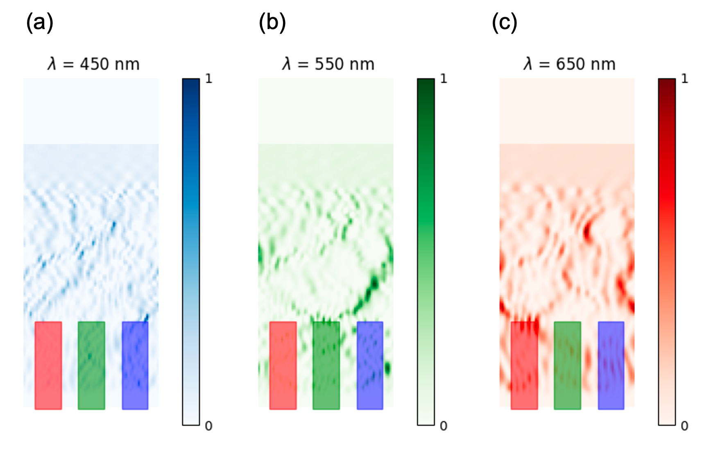

# AdjointDiffusion

[](LICENSE) [](https://www.python.org/) 




**AdjointDiffusion** is a new method for structural optimization using diffusion models. 
It is a **physics-guided and fabrication-aware structural optimization** using diffusion models augmented with adjoint gradient. By combining powerful generative models with adjoint sensitivity analysis, this approach can more efficiently discover complex, high-performance designs than the traditional methods.

The codes are provided following the paper named [Physics-guided and fabrication-aware
structural optimization using diffusion models](https://arxiv.org)

---

## Table of Contents

1. [TL;DR](#TL;DR)  
2. [Intuitive Explanation of Diffusion Models](#intuitive-explanation-of-diffusion-models)
3. [Installation](#installation)  
4. [Quick Start](#quick-start)  
5. [Experiment Logging with Weights & Biases](#experiment-logging-with-weights--biases)
6. [Results](#results)
7. [Code Organization](#code-organization)
8. [Citation](#citation)

## TL;DR

✨ **Integrating adjoint sensitivity analysis with diffusion models can generate high-performance and interesting structures!**

Key features:
- **Adjoint Sensitivity Integration**: Seamlessly incorporates adjoint gradients into the diffusion process.
- **Fabrication Constraints**: Accounts for manufacturability, ensuring real-world feasibility.
- **Extensibility**: Includes baseline algorithms (e.g., genetic algorithm) with sample scripts for data generation and training.
- **Experiment Tracking & Visualization**: Integrates with [Weights & Biases](https://wandb.ai/home).

---

## Intuitive Explanation of Diffusion Models

Imagine an ink drop falling into water — it slowly spreads and dissolves. Diffusion models mimic this process in reverse: they start from noise and slowly form meaningful structures. By guiding this "reverse diffusion" with gradients from an adjoint method, we ensure the final designs are optimized and fabrication-ready.

---


## Installation

This setup ensures compatibility between Meep and PyTorch. If you find any alternatives, feel free to contribute improvements via pull requests!

### 1. Clone the repository
```bash
git clone https://github.com/dongjin-seo2020/AdjointDiffusion.git
cd AdjointDiffusion
```

### 2. Set up a Python environment (recommended)


#### Using conda
To create and activate the recommended environment with necessary dependencies:

```bash
conda create -n adjoint_diffusion -c conda-forge pymeep pymeep-extras python=3.9 
conda activate adjoint_diffusion
```


### 3. Installation of other libraries

Install torch following the command (recommended):
```bash
pip install torch==2.0.1+cu117 torchvision==0.15.2+cu117 --index-url https://download.pytorch.org/whl/cu117
```

Install the required packages listed in `requirements.txt`:
```bash
pip install -r requirements.txt
```


If you encounter errors while installing `mpi4py`, try the following steps:
```bash
apt --fix-broken install
apt install mpich
pip install mpi4py
```
Make sure you have root access when using `apt`.


---

## Quick Start

1. **Generate a dataset:**

```bash
python dataset_generation.py
```

- The data will be saved at `datasets/<n>/sigma<k>/struct/`, where `n` is the structure dimension (e.g., `n=64` generates 64×64 binary structures) and `k` is the variance of the Gaussian filter (a larger `k` increases the minimum feature size).

2. **Update the training and sampling scripts** to specify the appropriate output directories.

- For example, for `train.sh`, you should specify the variables as:
```sh
DATA_DIR=/path/to/datasets
LOG_DIR=path/to/experiments
GPU_ID=0
```

- Or, you can set environment variables (Linux/macOS):
```bash
export DATA_DIR=/path/to/datasets
export LOG_DIR=/path/to/experiments
export GPU_ID=0
```

- For detailed usage examples, including training and sampling with actual settings, see:
  - [training_examples.ipynb](./training_examples.ipynb)
  - [sampling_example.ipynb](./sampling_example.ipynb)

3. **Train a diffusion model:**

```bash
./01-train.sh
```

- Alternatively: run `02-train.ipynb`

4. **Sample and optimize structures:**

```bash
./01-sample.sh
```

- Alternatively: run `02-sample.ipynb`


5. **View outputs**
- Every output (performance, structure) is logged in [wandb](#experiment-logging-with-weights--biases).
- Checkpoints (and logs) are saved in `./experiments/<run_name>`
- You can also view results by typing in your console:
```bash
wandb dashboard
```


6. **Baseline Algorithms**

We provide baseline algorithms in the `./baseline_algorithms` directory. These include **nlopt** methods like MMA for comparison.


## Experiment Logging with Weights & Biases

We use [wandb](https://wandb.ai/home) for logging and visualization.

1. Sign up at [wandb.ai](https://wandb.ai)
2. Log in:
```bash
wandb login
```
3. Run any training/sampling script and it will automatically log data to wandb.

---


## Results

We visualize the performance of AdjointDiffusion across different tasks and configurations.


### Optimization Convergence and Comparisons - Problem Setup 1 (Waveguide)




### Comparison of Generated Structures - Problem Setup 1 (Waveguide)




### Optimization Convergence and Comparisons 2 - Problem Setup 2 (Multi-wavelength Splitter)



### Comparison of Generated Structures - Problem Setup 2 (Multi-wavelength Splitter)


### Result: Waveguide




### Result: Multi-wavelength Splitter



---

## Code Organization

```
AdjointDiffusion/
├── dataset_generation.py       # Dataset generation script
├── image_train.py              # Main training script
├── image_sample.py             # Main sampling script
├── requirements.txt            # Python dependencies
├── guided_diffusion/           # Backend of diffusion models
└── baseline_algorithms/        # Baseline algorithms (nlopt, Gradient Ascent)
```

---

## Citation

If you use this code, please cite the following paper:

```bibtex
@article{YourCitation,
  title   = {Physics-guided and fabrication-aware structural optimization using diffusion models},
  author  = {Dongjin Seo†, Soobin Um†, Sangbin Lee, Jong Chul Ye*, Haejun Chung*},
  journal = {arXiv},
  year    = {2025},
  url     = {https://arxiv.org/}
}
```

---


## Acknowledgements

Parts of this repository are adapted from [OpenAI's guided-diffusion](https://github.com/openai/guided-diffusion), which is licensed under the MIT License.

We thank the OpenAI team for their contribution. Significant modifications have been made to enable adjoint sensitivity integration and fabrication-aware optimization.

---
**Happy Diffusing & Optimizing!**
